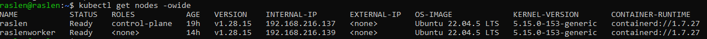

# Configuration de MetalLB dans un Cluster Kubernetes Local (Kubeadm/Bare-Metal)

Ce guide détaille l'installation et la configuration de MetalLB, un Load Balancer logiciel pour Kubernetes, essentiel pour exposer des services de type `LoadBalancer` dans des environnements qui ne sont pas hébergés sur un Cloud Provider (comme un cluster Kubeadm, Bare-Metal ou des VMs).


## 💡 Pourquoi MetalLB ?

Dans un cluster Kubernetes déployé sur un Cloud Provider (AWS, Azure, GCP, etc.), la création d'un service de type `LoadBalancer` attribue automatiquement une IP publique et provisionne un Load Balancer externe managé.

Pour les clusters locaux (VMs, Bare-Metal), Kubernetes n'a pas cette capacité "native" de provisionner un Load Balancer externe. Par conséquent, les Services de type `LoadBalancer` restent en état `<pending>` pour l'`EXTERNAL-IP`.

**MetalLB comble ce manque** en permettant à ton cluster d'attribuer des adresses IP de ton réseau local aux services `LoadBalancer`, rendant tes applications accessibles depuis l'extérieur du cluster via ces IPs.


## Pré-requis


*   Un cluster Kubernetes fonctionnel avec au moins un nœud de contrôle et un nœud worker. Si vous n'en avez pas, consultez la section ci-dessous pour le provisionner avec Ansible.
*   Accès `kubectl` configuré pour ton cluster.
*   `docker` ou `containerd` fonctionnel sur tes nœuds.
*   Une plage d'adresses IP **libres et non utilisées** sur le **même sous-réseau** que tes nœuds Kubernetes.
    *   **Exemple :** Si tes nœuds ont les IPs `192.168.216.137` et `192.168.216.139`, tu peux choisir une plage comme `192.168.216.150-192.168.216.160`.


### Optionnel : Provisionner un Cluster Kubernetes avec Ansible

Si vous n'avez pas encore de cluster Kubernetes ou souhaitez en créer un rapidement et de manière reproductible, vous pouvez utiliser le playbook Ansible suivant :

1.  **Assurez-vous d'avoir Ansible installé** sur votre machine locale.
2.  **Clonez le dépôt ou naviguez** vers le répertoire contenant votre configuration Ansible pour Kubernetes (par exemple, `~/tutenv/ansible/`).
3.  **Vérifiez ou adaptez votre fichier d'inventaire `inventory.ini`** pour qu'il pointe vers vos machines cibles (VMs ou physiques).
4.  **Lancez le playbook Ansible** pour provisionner votre cluster :

    ```bash
    cd ~/tutenv/ansible  # Adaptez ce chemin si nécessaire
    ansible-playbook -i inventory.ini ../cluster-k8s/playbook-cluster.yaml
    ```
    *Cette commande exécutera le playbook qui configurera un cluster Kubernetes Kubeadm multi-nœuds sur les machines spécifiées dans votre inventaire Ansible.*


## 🚀 Étapes de Configuration de MetalLB

Suis ces étapes pour installer et configurer MetalLB.

### Étape 1: Identifier les Adresses IP de tes Nœuds

Pour choisir une plage d'IP adéquate, vérifie le sous-réseau de tes nœuds Kubernetes.

```bash
kubectl get nodes -o wide

``````



# Étape 2: Installation de MetalLB


